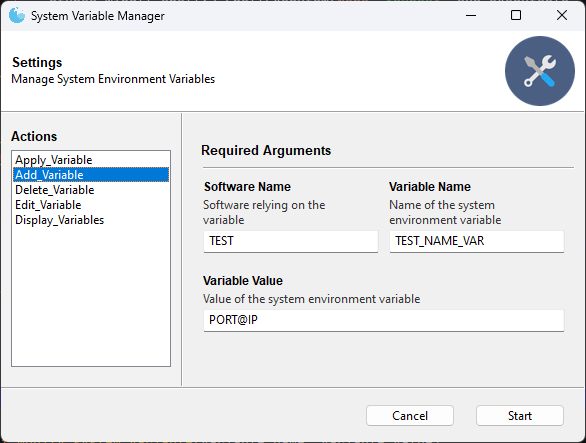
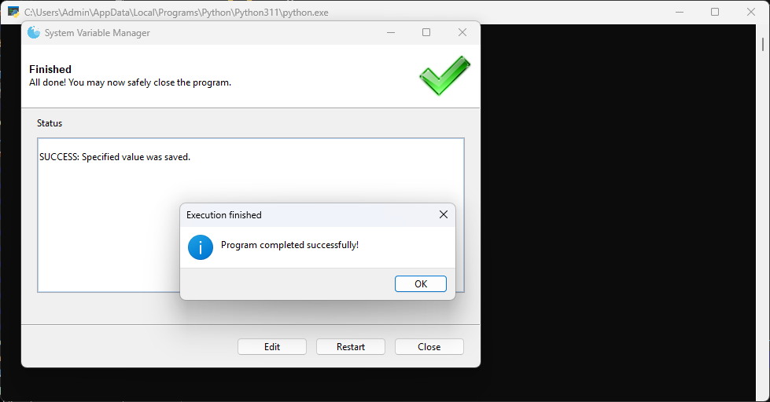
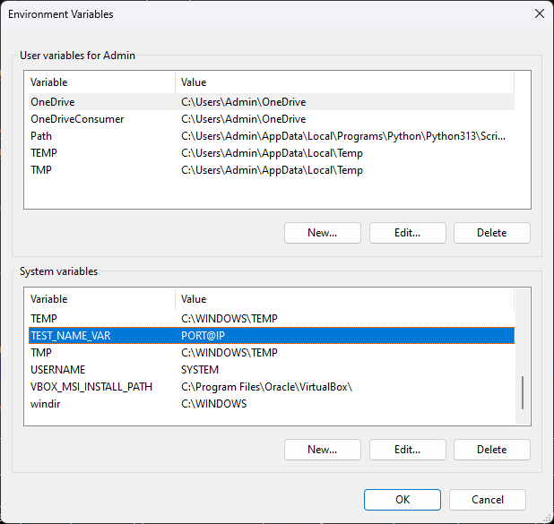
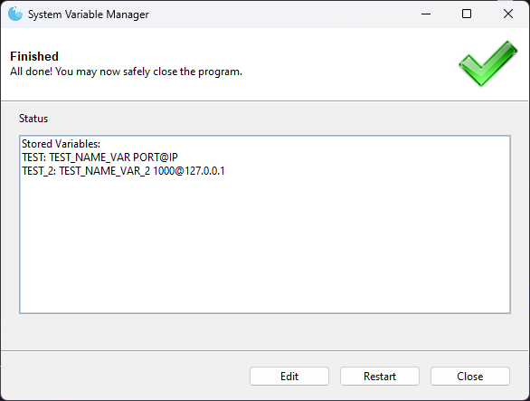

Pending ...

# System Variable Manager

System Variable Manager is a versatile application designed to manage and monitor system environment variables. This user-friendly desktop application simplifies the process of adding, editing, deleting, and applying environment variables, ensuring efficient system management and customization.

## Key Features

- **Add Environment Variables**: Easily add new system environment variables with a user-friendly interface.
- **Edit Environment Variables**: Modify existing environment variables to update their values as needed.
- **Delete Environment Variables**: Remove environment variables that are no longer needed.
- **Apply Environment Variables**: Apply changes to environment variables to ensure they take effect immediately.
- **Display Environment Variables**: View all stored environment variables in a structured format.

## Getting Started

### Prerequisites

Before running System Variable Manager, you need to have Python installed on your machine, along with the following library: `Gooey`.

### Installation

1. Clone the repository or download the `main.py` script to your local machine.
2. Install the required Python library with the following command:
   ```sh
   pip install Gooey

### Screenshots
|  |   |
|:-------------------------------------------:|:--------------------------------------------:|
|               Add VAR to JSON               |                   Apply SYS Var                    |
|         |  |
|              Sys Vars Windows               |                   Display VARs                    |


